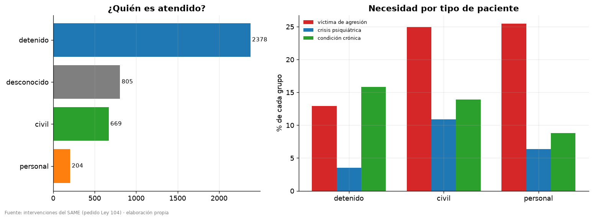
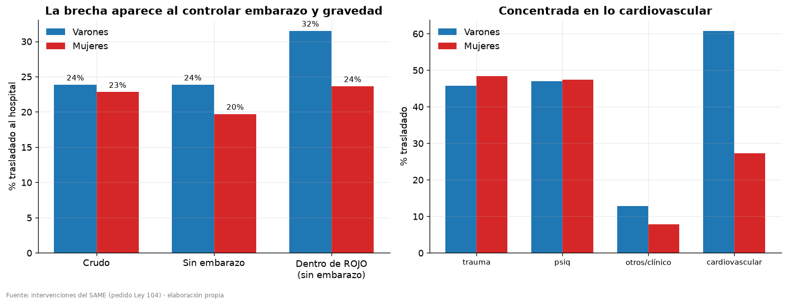
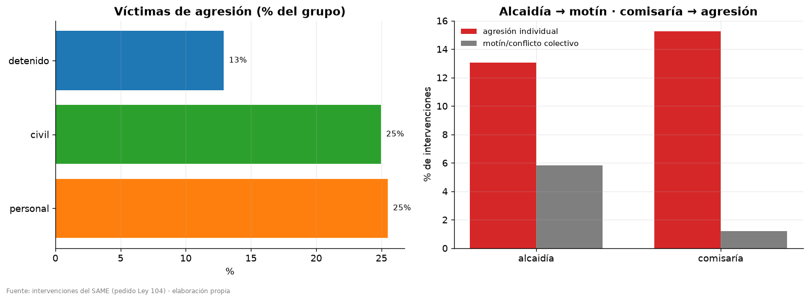
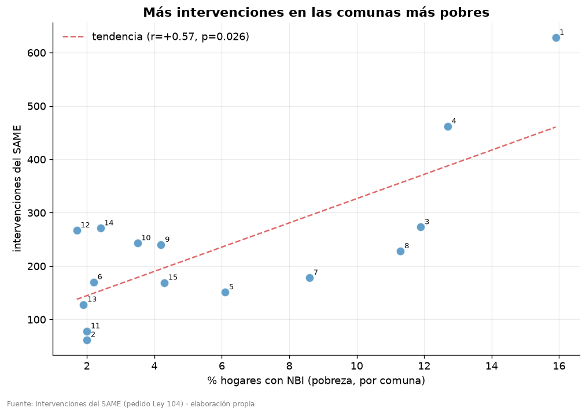
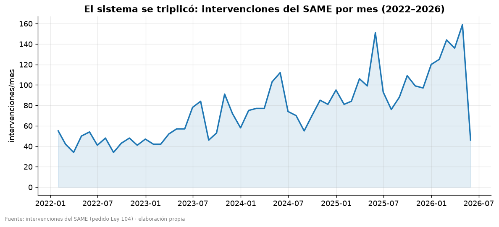

# Hallazgos — SAME en dependencias penitenciarias y policiales de CABA

Resumen narrativo de los hallazgos **publicables**, listo para storytelling. El detalle
metodológico, las hipótesis y los tests están en [`plan-analisis.md`](plan-analisis.md).

## Qué es esto

4.056 intervenciones del SAME en comisarías y alcaidías de la Ciudad de Buenos Aires,
**01/2022–05/2026**, obtenidas por un pedido de acceso a la información pública (Ley 104).
El Estado las entregó como un **PDF de 317 páginas**; las convertimos en un dataset
consultable: extraído, **anonimizado** (se removió la PII que el PDF traía), **geocodificado**
(USIG) y **enriquecido** con 24 variables cualitativas (LLM) + comuna y NBI.

## Cómo leer estos datos (3 advertencias que ordenan todo)

1. **No es "salud en CABA" — es salud de quienes pasan por la custodia.** Y no son solo
   detenidos: la población es **mixta**.
2. **Hay numeradores, no denominadores.** Sabemos *cuántas* intervenciones, no *sobre cuánta
   población*. Por eso se cuenta, no se calculan tasas por persona.
3. **Asociaciones, no causas.** Todo es observacional; las variables de texto son
   best-effort de un LLM.

## Los hallazgos

### 1. No son solo detenidos: la comisaría como acceso de salud mental
El paciente es **detenido en 59%**, pero **civil en 16,5%** y **personal policial en 5%**.
Los **civiles** que llegan a la comisaría son sobre todo **víctimas de agresión (25%)** y
**gente en crisis psiquiátrica (11%, diagnóstico PSIQUIÁTRICAS 12%)** — la dependencia
funciona como **punto de acceso de salud mental de último recurso**. El **personal policial**
aparece como víctima de lesiones (agresión 25%).

### 2. 🎯 Una brecha de género en el traslado al hospital
A primera vista no hay brecha (traslado M 24% vs F 23%). Pero el **embarazo** infla el
traslado de las mujeres (65% vs 20%). Al controlar embarazo, gravedad y diagnóstico:
- **Las mujeres se trasladan ~38% menos** que los varones (OR 0,62, p=0,004).
- **Las codifican más críticas** (ROJO 67% vs 60%) **pero las trasladan menos**: no es un
  problema de triage, es la decisión de traslado.
- **Dentro de los casos ROJO**: mujeres 24% vs varones 32% (p=0,009).
- Concentrado en lo **cardiovascular** (mujeres 27% vs varones 61%) — eco del subtratamiento
  cardíaco femenino que la literatura médica documenta.

Es una posible **inequidad de acceso por género**. Honesto: observacional, con subgrupos
chicos; es una señal fuerte que merece mirarse más fino, no una prueba causal.

### 3. Violencia en 1 de cada 6 intervenciones
- **Personal y civiles son víctimas de agresión al 25%** (el doble que los detenidos, 13%).
- Por setting: **alcaidías → motines** (conflicto colectivo, detención prolongada);
  **comisarías → agresión individual**.
- **1 de cada 7 agresiones es con arma blanca** — armas dentro de la custodia.
- El *share* de violencia se mantuvo estable (~15%) aunque el volumen total se triplicó.

### 4. Geografía: la detención se concentra en las comunas pobres
- **Comuna 1** (centro) concentra el volumen; el volumen de intervenciones **correlaciona
  con la pobreza de la comuna** (NBI, r=+0,57, p=0,026).
- La **violencia, en cambio, no tiene gradiente socioeconómico barrial** (r=-0,10, ns):
  depende del setting de detención, no del barrio.
- Mapas de puntos y choropleth por comuna en `data/processed/`.

### 5. Un sistema que se triplicó
Las intervenciones pasaron de ~45/mes (2022) a ~140/mes (2026) — probablemente la
**expansión del sistema de alcaidías de CABA / mejor registro**, no necesariamente más
morbilidad (otra vez, el denominador).

## Lo que queda FUERA del relato visual (decisión editorial)

La **autolesión, el intento de suicidio y la ingesta de cuerpo extraño** se analizan
internamente pero **no van al storytelling público**: por lo gráfico y por el **riesgo de
contagio/incentivo** (efecto Werther). Internamente sí hay un patrón fuerte (concentración
en detención prolongada, nocturno, y traslado por encima de la gravedad clínica), pero no
se publica con detalle ni en mapas.

## Limitaciones

Sin denominador (población detenida por comuna/período) → conteos, no tasas · sexo
"desconocido" en 36% pese a la mejora · sin outcomes (mortalidad, tiempos) · sin linkage de
persona (removido por privacidad → no se mide reincidencia) · `traslado` subregistrado (se usa
`traslado OR destino`) · variables LLM best-effort.

## Qué falta

El dato faltante #1 son los **denominadores** (población alojada por dependencia y período) —
desbloquearía pasar de conteos a tasas. Probablemente requiera otro pedido Ley 104.
